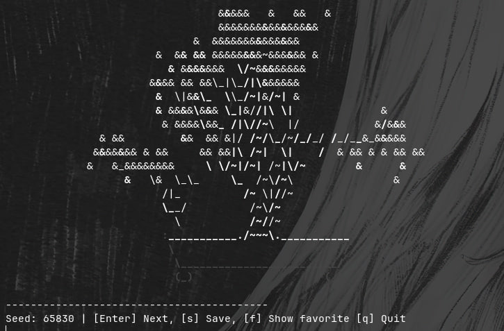

# 🌱 Bonsai Scout

**Bonsai Scout** is a lightweight, interactive CLI tool written in Rust that helps you discover aesthetically pleasing tree configurations (seeds) for `cbonsai`.



Instead of manually rerunning random generations, Bonsai Scout streamlines the process with a smooth, keyboard-driven workflow — making exploration fast, fun, and efficient.

---

## ✨ Features

* 🎲 **Smart Random Generation**
  Generates random seeds while safely avoiding invalid values (e.g. seed `0`).

* ⌨️ **Interactive CLI Navigation**

  * `Enter` → Generate the next tree
  * `s` → Save current seed to favorites
  * `f` → View saved seeds collection
  * `q` → Quit the application

* ⭐ **Favorites System**
  Save the best-looking seeds into a local file:
  `favorite_seeds.txt`

* 🧠 **Clean Rust Architecture**
  Built using structured, object-oriented design patterns with `struct` and `impl` blocks.

* ⚡ **Lightweight & Fast**
  Minimal dependencies, instant startup, and efficient execution.

---

## 📦 Installation

### Prerequisites

* Rust (latest stable recommended)
* `cbonsai` installed and available in your PATH

### Clone & Build

```bash
git clone https://github.com/yourusername/bonsai-scout.git
cd bonsai-scout
cargo build --release
```

### Run

```bash
cargo run --release
```

---

## 🚀 Usage

Once launched, Bonsai Scout enters interactive mode:

```text
Press Enter → Generate new tree
Press 's'   → Save current seed
Press 'f'   → Show favorites
Press 'q'   → Quit
```

Each generated seed can be reused directly with `cbonsai`:

```bash
cbonsai -s <seed>
```

---

## 🛠️ How It Works

Bonsai Scout is designed with clarity and modularity in mind, leveraging Rust’s strengths in safety and performance.

### Architecture Overview

* **Core Structs**

  * `SeedGenerator` → Handles random seed generation with validation
  * `FavoritesManager` → Responsible for storing and retrieving saved seeds
  * `App` → Controls the interactive loop and user input handling

* **Implementation (`impl`) Blocks**
  Each struct encapsulates its behavior through dedicated methods, promoting:

  * Separation of concerns
  * Readable, maintainable code
  * Easy extensibility

* **Input Handling**
  A simple event loop processes user keystrokes and maps them to actions without unnecessary complexity.

* **File Persistence**
  Favorites are stored in a plain text file (`favorite_seeds.txt`), ensuring:

  * Transparency
  * Easy manual editing
  * Zero overhead

---

## 🎯 Philosophy

Bonsai Scout focuses on doing one thing well:

> Helping you quickly find beautiful procedural bonsai trees 🌿

No bloated UI. No unnecessary abstractions.
Just a clean, efficient tool that fits naturally into your workflow.

---

## 🤝 Contributing

Feel free to open issues or submit pull requests if you have ideas for improvements!

---

## 📄 License

MIT License — use it freely.

---

Enjoy exploring 🌱

